<div align="center">
  <h1>🌌 ZeroCode: Autonomous Multi-Agent IDE</h1>
  <p><b>Eliminating verification fatigue with an auto-healing, multi-agent development environment powered by Alibaba OpenSandbox.</b></p>

  [](#)
  [](#)
  [](#)
  [](#)
</div>

---

## 📖 The Origin Story: Why ZeroCode?

Modern AI coding tools are advanced autocomplete. The human developer is forced to become the AI's debugger—running code, copying terminal errors, and pasting them back to the LLM. This constant context-switching creates immense **Verification Fatigue**.

Our solution: An autonomous loop where AI writes code, an independent AI agent tests it inside a secure, containerized sandbox, and the system intelligently fixes its own bugs before ever presenting it to the human.

> **Architectural Invariant:** The system must verify its own work inside a sandbox and fix itself when verification fails. The user receives a completed, passing result, not a raw terminal output of failures.

---

## ✨ Key Innovations (The Enterprise Architecture)

*   **LLM Economic Routing:** We dynamically distribute tasks across specialized models based on cost and capability to optimize performance and economics.
    *   **Leader:** High-cost, high-reasoning (Gemini 3.1 Pro, GPT-4o) for task decomposition, planning, and mentorship.
    *   **Dev:** Low-cost, high SWE-Bench (DeepSeek Coder, Minimax m2.5) for fast, iterative code implementation.
    *   **QA:** Mid-cost, high-logic (GLM 5, Claude 3.5 Sonnet) for robust testing and multi-dimensional critique scoring.

*   **The Mentorship Loop:** When a Dev agent fails a QA check twice, the task doesn't simply fail. The `TaskDelegator` intercepts the failure and invokes the Leader in a targeted *Mentorship Mode*. The Leader analyzes the `critique_report.md` and outputs architectural guidance (`leader_guidance.md`). The Dev agent receives a final, mentored attempt armed with this guidance, optimized by our `LLMSummarizingCondenser` to prevent token explosion.

*   **Enterprise Sandboxing (Alibaba OpenSandbox):** True isolation and safety.
    *   **CGroup Resource Limits:** Strict CPU and memory limits prevent rogue regexes or infinite loops from triggering node OOMs.
    *   **Zero-Trust Network Isolation:** Sandboxes are provisioned without egress, preventing Dev agents from executing rogue API calls or exfiltrating codebase secrets.
    *   **Fast Snapshots:** When QA fails catastrophically, we leverage instant container rollbacks, restoring the environment before the Dev agent’s broken attempt to avoid spaghetti-code untangling.

*   **QA Dimensional Scoring:** QA failures no longer collapse into raw terminal text. Our QA agents emit a structured `qa:report` evaluating four key dimensions out of 100: **Code Quality, Requirements, Robustness, and Security**. This multi-dimensional scoring provides precise, actionable feedback for the Dev agent's retry loop via `DB-Before-Emit`.

---

## 🏗️ The Technology Stack

ZeroCode runs as a multi-process topology, maintaining zero in-memory authoritative state.

| Component | Technologies | Role |
| :--- | :--- | :--- |
| **Frontend** | React, Zustand, Xterm.js, Monaco | Renders the UI shell, streams terminal output, and visualizes code/file state via backend events. |
| **Backend** | FastAPI, Redis (Pub/Sub), Python Async Worker, PostgreSQL | Orchestrates run lifecycles, WebSocket event streaming, retry policies, and acts as the single source of truth (`DB-Before-Emit`). |
| **Brain** | Nanobot | Drives agent cognition, planning, skill usage, and consumes run-scoped HTTP MCP tools. |
| **Muscle** | Alibaba OpenSandbox | Provides secure, containerized execution, instant snapshotting, and robust resource/network isolation. |

---

## ⚙️ Architecture Diagram

Our control path is strictly enforced for predictable state management and security:

```mermaid
flowchart LR
    A[React UI] -->|REST / WebSockets| B[FastAPI Orchestrator]
    B -->|DB-Before-Emit| C[Redis Queue / PubSub]
    C -->|Dequeues| D[Async Worker]
    D -->|Instantiates| E[Nanobot Agents]
    E -->|MCP Tool Calls| F[Alibaba OpenSandbox Container]

    classDef ui fill:#61dafb,stroke:#333,stroke-width:2px,color:#000;
    classDef api fill:#009688,stroke:#333,stroke-width:2px,color:#fff;
    classDef queue fill:#e0245e,stroke:#333,stroke-width:2px,color:#fff;
    classDef worker fill:#ff9800,stroke:#333,stroke-width:2px,color:#fff;
    classDef brain fill:#9c27b0,stroke:#333,stroke-width:2px,color:#fff;
    classDef sandbox fill:#f44336,stroke:#333,stroke-width:2px,color:#fff;

    class A ui;
    class B api;
    class C queue;
    class D worker;
    class E brain;
    class F sandbox;
```



---

## 🚀 Getting Started

### Prerequisites

| Tool | Min Version | Download |
|------|-------------|----------|
| Python | 3.11+ | [python.org](https://www.python.org/downloads/) |
| Node.js | 18+ | [nodejs.org](https://nodejs.org/) |
| Docker & Compose | latest | [docker.com](https://docs.docker.com/get-docker/) |

### One-Click Setup

Clone the repository and run the setup script — it verifies dependencies, creates `.env` files, installs all packages, and boots Redis.

```bash
git clone https://github.com/hieuit095/zero-code.git
cd zero-code

# macOS / Linux
chmod +x setup.sh
./setup.sh

# Windows
setup.bat
```

The script will print exact next-steps when finished. In short:

```bash
# 1. Edit .env with your LLM API keys
# 2. Terminal 1 — Backend:   source backend/venv/bin/activate && cd backend && python -m uvicorn app.main:app --reload --port 8000
# 3. Terminal 2 — Worker:    source backend/venv/bin/activate && cd backend && python -m worker
# 4. Terminal 3 — Frontend:  npm run dev
# 5. Open http://localhost:5173
```

<details>
<summary><strong>Manual Setup (if you prefer not to use the script)</strong></summary>

#### 1. Configure Environment Variables
```bash
cp .env.example .env
cp backend/.env.example backend/.env
# Open both .env files and set your LLM API keys and MCP_JWT_SECRET
```

#### 2. Backend
```bash
python3 -m venv backend/venv
source backend/venv/bin/activate   # Windows: backend\venv\Scripts\activate
pip install -r backend/requirements.txt

# Terminal 1 — API Server
cd backend && python -m uvicorn app.main:app --reload --port 8000

# Terminal 2 — Async Worker
cd backend && python -m worker
```

#### 3. Frontend
```bash
npm install
npm run dev
```

#### 4. Infrastructure
```bash
docker compose -f infra/staging/docker-compose.yml up -d redis
```

</details>